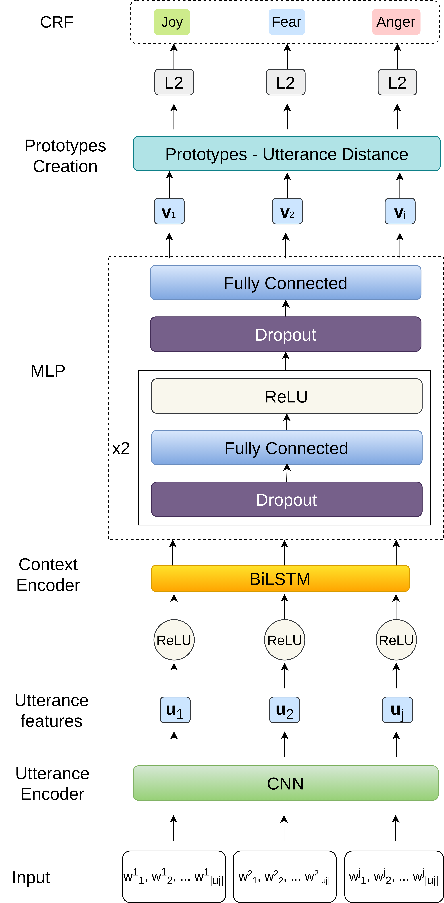

# ProtoSeq
This is the PyTorch code for the paper `Few-Shot Emotion Recognition in Conversation with Sequential Prototypical Networks` presented at [EMNLP 2021](https://2021.emnlp.org/).

This code presents our ProtoSeq model along with several baselines. This model is a variant of Prototypical Networks (Jake Snell et al., 2017) few-shot sequence labelling task. The code is made to run on DailyDialog (Li Yanran et al., 2017) and on the Live Chat Customer Service dataset. The latter is a proprietary one, thus you will be able to run the code on the former dataset.

Some parts of the code structure are inspired from (Bao et al. 2020). If you do not manage to run the code, please add an issue or contact us.

## Citing
If you find this repo or paper useful, please cite the following paper:
```
@inproceedings{guibon:hal-03344680, TITLE = {{Few-Shot Emotion Recognition in Conversation with Sequential Prototypical Networks}}, AUTHOR = {Guibon, Ga{\"e}l and Labeau, Matthieu and Flamein, H{\'e}l{\`e}ne and Lefeuvre, Luce and Clavel, Chlo{\'e}}, URL = {https://hal.archives-ouvertes.fr/hal-03344680}, BOOKTITLE = {{The 2021 Conference on Empirical Methods in Natural Language Processing (EMNLP 2021)}}, ADDRESS = {Punta Cana, Dominican Republic}, YEAR = {2021}, MONTH = Nov, HAL_ID = {hal-03344680}, HAL_VERSION = {v1},}
```

# Usage

## ProtoSeq on DailyDialog

```
python3 emotionClf.py --task fsl_emoseq --encoder cnnlstm_seq --crf --cuda 0
```



## Other reported results

WarmProto
```
python3 emotionClf.py --task fsl_emoseq --encoder rnn_seq --crf --warmproto --cuda 0
```
Proto
```
python3 emotionClf.py --task fsl_emoseq --encoder cnn_seq --classifier proto_seq --cuda 0
```

Variants showed in the paper:
ProtoSeq-AVG
```
python3 emotionClf.py --task fsl_emoseq --encoder avg_seq --classifier proto_seq --crf --cuda 0
```

ProtoSeq-Tr
```
python3 emotionClf.py --task fsl_emoseq --encoder transfo_seq --classifier proto_seq --crf --cuda 0
```

ProtoSeq-CNN
```
python3 emotionClf.py --task fsl_emoseq --encoder cnn_seq --classifier proto_seq --crf --cuda 0
```

# Requirements & environnement
We ran this code with the following setup.
- Python 3.8.2 environnement visible in `requirements.txt` (this is the full pip environnement for reference). Here are some key elements:
    - PyTorch 1.7.1
    - torchtext 0.8.1
    - [TorchCRF](https://pypi.org/project/TorchCRF/)
    - termcolor 1.1.0
    - scikit-learn 0.23.1
    - tweet-preprocessor 0.6.0
- GPU: Nvidia Quadro RTX 4000 with 2304 cuda cores and 8192 MB in VRAM (256-bit memory interface). Nvidia Driver version 450.51.05.
- CPU: Intel© Xeon© E-2234 CPU @ 3.60GHz × 4
- RAM: 15.5 Go
- OS: Linux Mint 20 Cinnamon (4.6.6). Kernel 5.4.0-26-generic

# (Optional) Data Preparation
Preprocessed file is already given in data/. However, if you wish to recompute the DailyDialog files please follow the following processes:
1. [Download DailyDialog](http://yanran.li/dailydialog.html)
2. unzip the folder in data/
3. run the following commands to format the data: 
```
python3 parser_gg.py -i data/ijcnlp_dailydialog/train -o data/train 
python3 parser_gg.py -i data/ijcnlp_dailydialog/validation -o data/validation
python3 parser_gg.py -i data/ijcnlp_dailydialog/test -o data/test
```
4. run the following command to preprocess and gather:
```
python3 emotionClf.py --task prepa_dataset
```
And that's it, `data/dailydialog_conv[context_size]seq_splits.json` should be created.

# Contacts

[Gaël Guibon](https://gguibon.github.io/)

[Matthieu Labeau](https://www.telecom-paris.fr/matthieu-labeau?l=en)

[Hélène Flamein](https://fr.linkedin.com/in/h%C3%A9l%C3%A8ne-flamein)

[Luce Lefeuvre](https://fr.linkedin.com/in/luce-lefeuvre-b1753020)

[Chloé Clavel](https://clavel.wp.imt.fr/)


